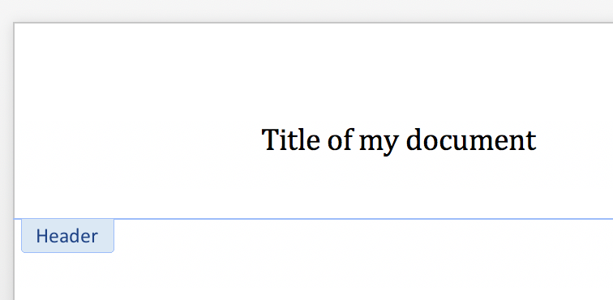

# 添加header

[_Header]: ../api/section_header.md
[Document]: ../api/document.md

只需编辑 [_Header] 对象的内容，就可以将标题添加到新文档中。 [_Header] 对象是一个“故事”容器，其内容可以像 [Document] 对象一样进行编辑。 请注意，与新文档一样，新标题已经包含一个（空）段落：

```python
>>> paragraph = header.paragraphs[0]
>>> paragraph.text = "Title of my document"
```



另请注意，添加内容（甚至只是访问 `header.paragraphs`）以及添加标题定义的行为会更改 `.is_linked_to_previous` 的状态：

```python
>>> header.is_linked_to_previous
False
```
