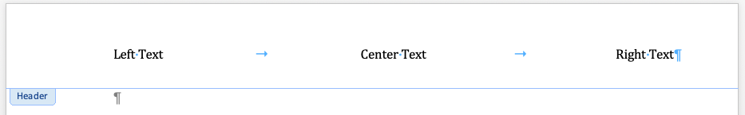

# 添加“zoned” header内容

具有多个“zoned”的标题通常使用精心放置的制表位来完成。

居中和右对齐“zone”所需的制表位是 Word 中页眉和页脚样式的一部分。 如果您使用的是自定义模板而不是 `python-docx` 默认模板，那么在模板中定义该样式可能是有意义的。

插入的制表符 ("\t") 用于分隔左对齐、居中和右对齐的标题内容：

```python
>>> paragraph = header.paragraphs[0]
>>> paragraph.text = "Left Text\tCenter Text\tRight Text"
>>> paragraph.style = document.styles["Header"]
```



`Header` 样式会自动应用到新的标题中，因此上面的第三行（应用 `Header` 样式）在这种情况下是不必要的，但在这里包含以说明一般情况。
